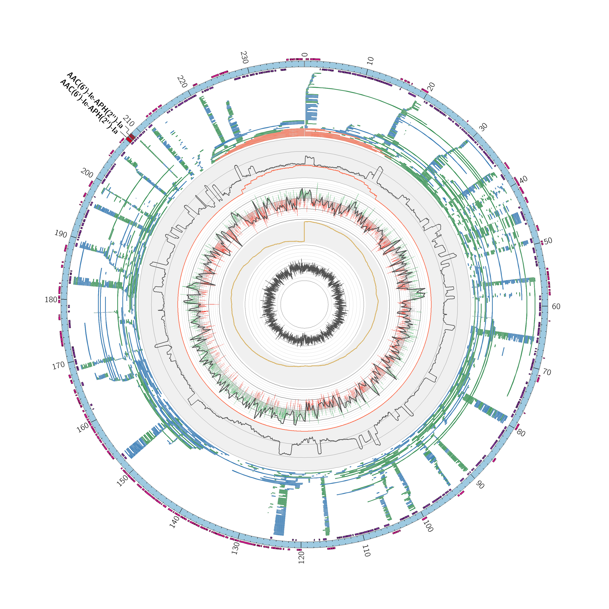

PlasmIdent
==========

[](https://travis-ci.org/caspargross/plasmIDent)

This pipeline idenfitifes circular plasmids in in bacterial genome assemblies by aligning long sequencing reads to putative plasmids. When overlapping long reads confirm circular plasmids,  resistance genes are identified and additional parameters calculated. 

The pipeline includes the following steps:
- Gene prediction with [Glimmer3](https://ccb.jhu.edu/software/glimmer/)
- Identification of antibiotic resistance genes in the CARD Database [RGI](https://card.mcmaster.ca/analyze/rgi)
- Long read alignment against assembly
- Coverage analysis with [Mosdepth](https://github.com/brentp/mosdepth)
- GC Content and GC Skew
- Identification of reads that overlap the gap in the plasmid, indicating circular reads

Requirements
------------

- Linux or Mac OS 
- Java 8.x
- Docker or Singularity container application *or* Conda package manager


Installation 
------------

1) Install [nextflow](https://www.nextflow.io/)

```
curl -s https://get.nextflow.io | bash 
```

This creates the `nextflow` executable in the current directory


2) Download pipeline 

You can either get the latest version by cloning this repository

```
git clone https://github.com/imgag/plasmIDent
```

or download on of the [releases](https://github.com/imgag/plasmIDent/releases).


3) Download dependencies

All the dependencies for this pipeline can be downloaded in a [docker](https://docs.docker.com/install/) container.

```
docker pull caspargross/plasmident
```

Alternative dependency installations:

- [Singularity Container](docs/alternative_installation.md#singularity_container)
- [Use conda environment (no docker)](docs/alternative_installation.md#conda_environment)


Run Application
---------------

The pipeline requires an input file with a sample id (string) and paths for the assembly file in .fasta format and long reads in `.fastq` or `.fastq.gz`. The paths can either be absolute or relative to the launch directory. In normal configuration (with docker), it is not possible to follow symbolic links. 

The file must be tab-separated and have the following format

|id |assembly|lr|
|---|--------|--|
|myid1| /path/to/assembly1.fasta|/path/to/reads1.fastq.gz|
|myid2| /path/to/assembly2.fasta|/path/to/reads2.fastq.gz|

The pipeline is started with the following command:

```
nextflow run plasmident --input read_locations.tsv

```

There are other [run profiles](doc/profiles) for specific environments.


### Optional run parameters

- `--outDir` Path of output folder
- `--seqPadding` Number of bases added at contig edges to improve long read alignment [Default: 1000]
- `--covWindow` Moving window size for coverage and gc content calculation [Default: 50]
- `--max_cpu` Number of threads used per process [Default: 4]
* `--max_memory` Maximum amount of memory available
- `--targetCov` Large read files are subsampled to this target coverage to speed up the process [Default: 50]

Results
-------

The pipeline creates the following output folders:

- `alignment`: Contains the long read alignment (full genome)
- `coverage`: Long read coverage for the whole input genome (compressed bedfile)
- `gc`: Windowed GC content (full genome)
- `genes`: Predicted gene locations
- `plasmids`: Nucleotide sequences for all confirmed plasmids in separate FASTA files
- `resistances`: GFF file with locations of identified resistance genes

Additional file:

- `sampleID_summary.csv`: Tabular text file with contig lengths, plasmid status and identified antibiotic resistance genes.


